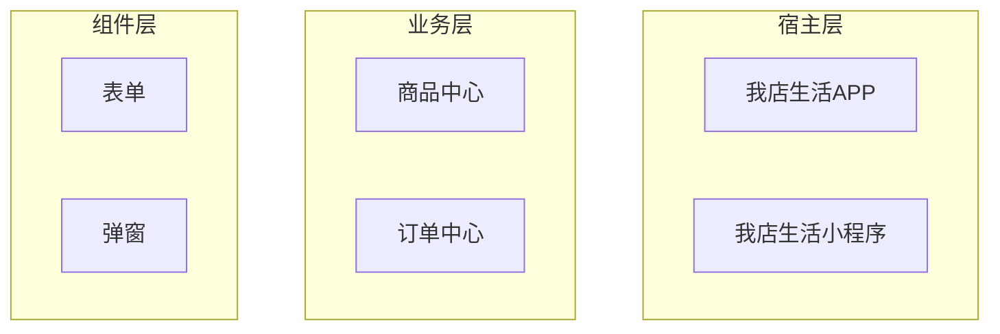

# Layered Capability Map Template

## 输入结构

```yaml
title: 我店生活大前端业务架构
legend:
  implemented: 已实现
  building: 建设中
  not_started: 未建设
  deprecated: 即将/已废弃
  external: 其他部门支持
layers:
  - name: 宿主层
    groups:
      - name: 入口
        items:
          - name: 我店生活APP
            status: implemented
          - name: 我店生活小程序
            status: implemented
  - name: 业务层
    groups:
      - name: 商品
        items:
          - name: 商品中心
            status: implemented
          - name: SKU
            status: implemented
      - name: 交易
        items:
          - name: 订单中心
            status: implemented
  - name: 组件层
    groups:
      - name: 基础组件
        items:
          - name: 表单
            status: implemented
          - name: 弹窗
            status: implemented
  - name: 开发域
    groups:
      - name: 工程能力
        items:
          - name: 脚手架
            status: implemented
          - name: 微前端
            status: implemented
```

## 输出结构

输出架构图前，先给出一份结构化清单：

```markdown
## 架构分层

- 宿主层：...
- 业务层：...
- 组件层：...
- 基础层：...
- 开发域：...
- 运维域：...
- 运营域：...
```

然后再绘图。

## Mermaid 降级草图

只有在无法使用画板/SVG 时才使用：


