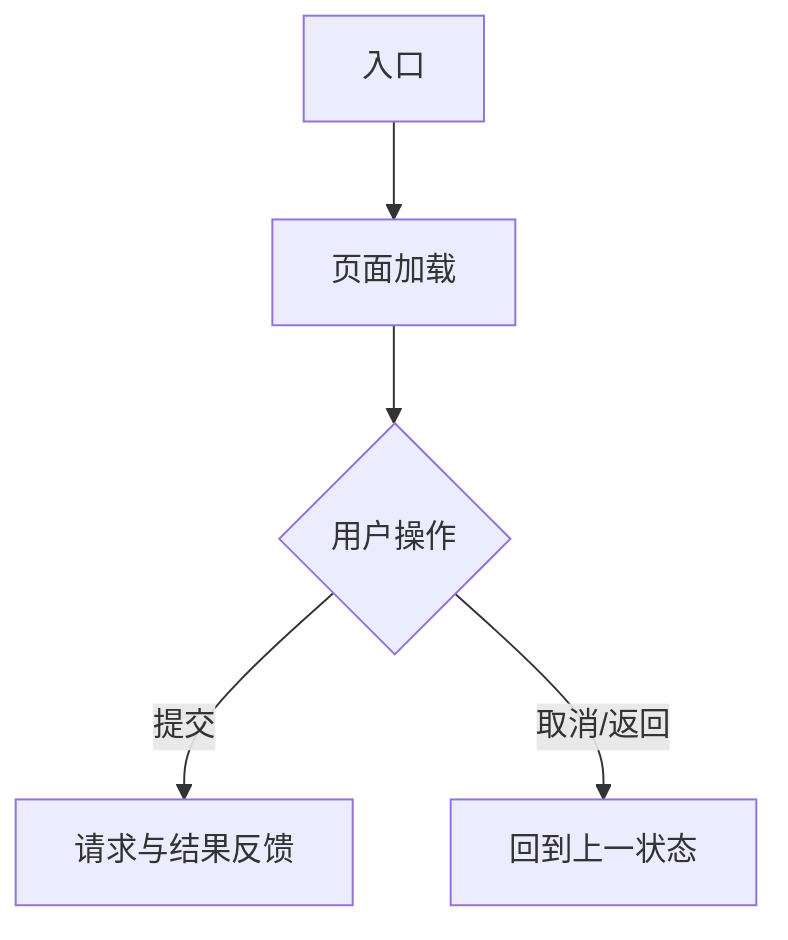

# 前端技术方案文档结构

按以下结构生成 `docs/tech/<需求名>-frontend-tech-design.md`。以团队模板的章节结构为基础；没有依据的具体数值、接口或策略不得虚构。

```markdown
# <需求名> 前端技术方案设计

## 一、需求背景与概述

### 核心目标

#### 业务目标

- <来自 PRD 的目标与成功标准>

#### 技术目标

- <性能、兼容性、稳定性等已确认指标；未确认时列待确认项>

### 用户场景

- **高频场景**：谁 → 做什么 → 达成什么。
- **核心路径**：入口 → 页面/操作 → 结果。
- **特殊场景**：历史数据、异常、权限、弱网或中断续办（仅保留实际场景）。

## 二、技术架构设计

### 改动范围与分层

| 层级/模块 | 现状 | 本次改动 | 依据 |
| --- | --- | --- | --- |
| 子应用/页面/路由 |  |  | 仓库 / PRD |
| 组件与状态 |  |  | Figma 信息 / 仓库 |
| 请求与适配层 |  |  | 接口文档 |

### 关键流程设计



用实际流程替换示例；流程不足三步时改为文字说明。

## 三、核心实现方案

### 风险评估

| 风险 | 影响 | 处理/规避策略 | 责任方/待确认 |
| --- | --- | --- | --- |
|  |  |  |  |

### 方案实现

#### 组件复用方案

按页面/功能模块逐项填写；禁止写“复用现有组件”“参考某模块实现”等笼统描述。

| 页面/功能模块 | 现有组件精确路径 | 基础组件库组件 | 结论 | 判断依据与使用边界 | 新增组件名称 / 归属目录 / 责任 |
| --- | --- | --- | --- | --- | --- |
|  | `src/...`；无则写“未找到” | PC：`DcgjTable` / `DcgjDrawer` / `DcgjUpload`；小程序：`uview-plus` 组件 / 本端组件 | 直接复用 / 不复用 / 新增业务组件 | 必须核对 props、事件、单多选、数据契约和固定样式；不复用时写明具体缺口 | 仅新增时填写；不得修改全局组件或跨子应用引用 |

- PC 端优先使用项目 `dcgj-ui` 的二开组件；小程序端仅使用项目现有 `uview-plus` 和本端组件体系。
- “直接复用”必须已确认现有 props、事件和能力可覆盖需求；否则选“不复用”或“新增业务组件”。

#### 核心逻辑与数据流

- <数据加载、编辑、提交、反馈、异常恢复等>

#### 性能、兼容与其他专项

- <仅保留本次实际适用项；不适用时说明原因>

## 四、接口设计

### 接口设计说明

- 鉴权/店铺或租户上下文、请求封装、错误码与重试口径。
- 同步/异步、幂等、缓存或轮询等仅在接口文档或需求明确时描述。

### 核心接口列表

| 场景 | 方法与路径 | 请求要点 | 响应/状态处理 | 契约状态 |
| --- | --- | --- | --- | --- |
|  |  |  |  | 已确认 / 待确认 |

## 五、质量保障

### 测试方案

| 类型 | 覆盖范围 | 关键验证点 |
| --- | --- | --- |
| 功能 / 回归 / 兼容 / 性能 |  |  |

### 关键用例、灰度、监控与回滚

- <按实际适用项说明；不适用时说明原因>

## 六、开发协作

### 协作与依赖

| 事项 | 依赖方 | 前置条件 | 交付物 |
| --- | --- | --- | --- |
|  |  |  |  |

### 代码管理

- 仓库、分支命名和分支策略：引用现有团队规范；未提供时列待确认项。

## 七、发布计划与验收方案

### 发布依赖

- <发布文档、开关、配置、数据或后端依赖>

### 验收标准

| 维度 | 验收项 | 验证方式 |
| --- | --- | --- |
| 功能完整性 |  |  |
| 用户体验/设计还原 |  |  |
| 性能/兼容性 |  |  |

## 八、问题汇总与待确认

| 问题/Gap | 对方案的影响 | 建议确认方 | 结论状态 |
| --- | --- | --- | --- |
|  |  |  | 待确认 / 已确认 |
```
