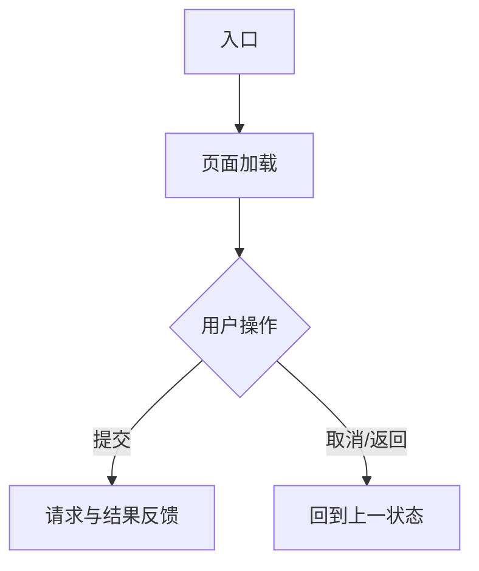

# 前端技术方案文档结构

按以下结构生成 `docs/tech/<需求名>-frontend-tech-design.md`。没有依据的具体数值、接口或策略不得虚构；待确认项在出现处就地标注“⚠️ 待确认”，结尾总表只做汇总索引。

章节顺序说明：默认“页面与路由”在“核心流程图”之前；需求以单页面内复杂交互为主、跨页面跳转很少时，可交换二者顺序。

```markdown
# <需求名> 前端技术方案设计

## 一、概述与范围

- PRD：<链接原文>；功能拆解：<链接>；Figma 信息：<链接>。
- <两三句说明本次需求做什么、改动落在哪个子应用/模块，不复述业务目标与用户场景>

## 二、页面与路由

| 页面 | 路由 | 现状 | 本次改动 | 依据 |
| --- | --- | --- | --- | --- |
|  |  | 新增 / 已有 |  | 仓库 / PRD / Figma |

- <入口、页面间跳转关系、权限或店铺/租户上下文对路由的影响>
- 设计稿未覆盖的页面状态在此就地标注：⚠️ 待确认：…

## 三、核心流程图



用实际流程替换示例；流程不足三步或无分支/异步状态时改为文字说明，不要为画图而画图。

## 四、组件复用方案

按页面/功能模块逐项填写；禁止写“复用现有组件”“参考某模块实现”等笼统描述。

| 页面/功能模块 | 现有组件精确路径 | 基础组件库组件 | 结论 | 判断依据与使用边界 | 新增组件名称 / 归属目录 / 责任 |
| --- | --- | --- | --- | --- | --- |
|  | `src/...`；无则写“未找到” | PC：`DcgjTable` / `DcgjDrawer` / `DcgjUpload`；小程序：`uview-plus` 组件 / 本端组件 | 直接复用 / 不复用 / 新增业务组件 | 必须核对 props、事件、单多选、数据契约和固定样式；不复用时写明具体缺口 | 仅新增时填写；不得修改全局组件或跨子应用引用 |

- PC 端优先使用项目 `dcgj-ui` 的二开组件；小程序端仅使用项目现有 `uview-plus` 和本端组件体系。
- “直接复用”必须已确认现有 props、事件和能力可覆盖需求；否则选“不复用”或“新增业务组件”。

## 五、关键状态与数据流

按核心功能逐项说明前端职责边界：

- **状态归属**：<前端持有哪些状态（本地/store）、哪些由接口驱动、派生状态如何计算>
- **校验职责**：<哪些校验在前端做、哪些依赖后端返回，前后端各自的失败反馈>
- **异常兜底**：<加载失败、提交失败、超时、并发冲突时前端的行为与恢复路径>
- **数据流向**：<加载 → 编辑 → 提交 → 反馈的关键链路；涉及跨页面/跨组件传递时写明载体>

职责边界不明确处就地标注：⚠️ 待确认：…

## 六、约束、兜底与注意点

| 约束/风险 | 影响 | 兜底或规避策略 | 状态 |
| --- | --- | --- | --- |
| <接口未定 / 设计缺口 / 兼容性 / 时序 / 历史数据等> |  |  | 已确认 / ⚠️ 待确认 |

- <其他实现注意点：埋点、文案、缓存、防抖/幂等等，仅保留本次实际适用项>
- 灰度/监控/回滚仅在需求明确要求时在此说明。

## 七、核心接口清单

- 鉴权/店铺或租户上下文、请求封装、错误码与重试口径。
- 同步/异步、幂等、缓存或轮询等仅在接口文档或需求明确时描述。

| 场景 | 方法与路径 | 请求要点 | 响应/状态处理 | 契约状态 |
| --- | --- | --- | --- | --- |
|  |  |  |  | 已确认 / ⚠️ 待确认 |

## 八、单测点

| 模块/函数 | 测试点 | 关键边界 |
| --- | --- | --- |
|  | <具体可测的行为，如“多选筛选变更后请求参数正确拼接”> | <空值、边界值、异常分支> |

只列本次改动引入或影响的可测行为，不写“功能/回归/兼容/性能”式的空表。

## 九、待确认问题总表

汇总前文所有 ⚠️ 待确认项，注明出现章节；本表只做索引和销项，不做唯一记录点。

| 问题/Gap | 出现章节 | 对方案的影响 | 建议确认方 | 结论状态 |
| --- | --- | --- | --- | --- |
|  |  |  |  | 待确认 / 已确认 |
```
